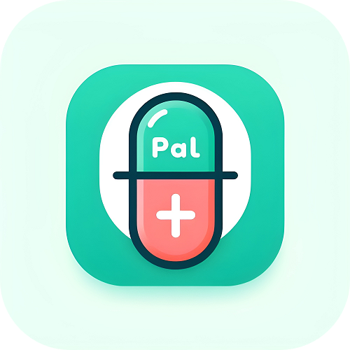

  

PillPal is a capstone project at FPT University. The app helps users to search for information about drugs and support taking medications as prescribed.

To realize the project, we use the main following technologies:

| Technology | For what? | Description |
| --- | --- | --- |
| Flutter | User App | A framework for building native applications using the Dart language. |
| React | Admin/Manager Webapp | A JavaScript library for building user interfaces. |
| .NET8 | Backend API | A free, cross-platform, open-source developer platform for building many different types of applications. |
| MS SQL Server | Database | A relational database management system developed by Microsoft. |
| Redis | Cache Database | An open-source, in-memory data structure store, used as a database, cache. |

----

For more information, check [pillpal-overview](https://github.com/Pill-Pal-Group/pillpal-overview).
